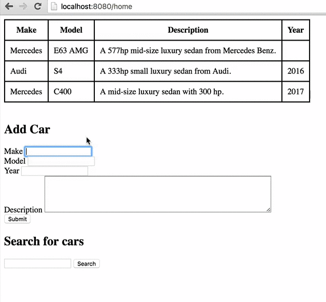

This directory contains the code listing for a
[tutorial](https://tests4geeks.com/tutorials/spring-data-boot-mongodb-example/) 
on [tests4geeks.com](https://tests4geeks.com/tutorials) about using
[MongoDB](http://mongodb.org) with Spring Boot and Spring Data. 

This tutorial builds a really simple car database, and the end product looks like this:

